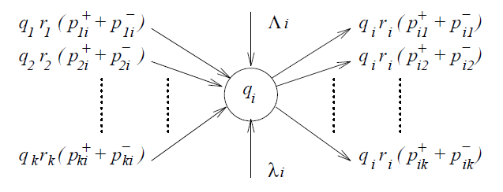

# Random Neural Network (RANN) [](https://www.python.org/)

**Random Neural Network** is a different ANN structure that implements G-Queues to Artifiacial Neural Network. Unlike the conventional Artificial Neuron structure (McCulloch-Pitts neuron), Random Neurons uses probabilistic calculations and do not need any activation functions. It has been used successfully in various applications areas such as classification, **regression**, **optimization**, **image processing**, **compression** and **associative memories**.

# Table of contents

- [Overview](#overview)
- [Installation](#installation)
- [Usage](#usage)
- [References](#references)
- [License](#license)

## Quick Overview of the Network Model 🕮 <a name="overview"></a>

It has been proposed by E. Gelenbe in 1989. A Random Neural Network is a compose of **Random Neurons** and **Spikes** that circulates through the network. According to this model, each neuron has a positive potential which enables itself to emit two kind of signals: *positive* and *negative*. These signals with unit amplitude, circulate in the networks and affects the potential of the target neurons by increasing or decreasing. Unless the potential value of the neuron which is defined as integer is zero, the negative signals creates inhibition effect and decrease the potential by 1 since it is amplitude is 1. Otherwise potential does not get affected by the inhibiting signals and have a potential of zero until a positive signal is received. Network can also establish signal transmission with the outside world. 



In 1990, Gelenbe declared the stability condition of the Random Neural Network [7] and in 1993 a recurrent structure regarding Random Neural Network is presented with detailed explanations of feedforward and backpropagation phases [8]. 
## Installation 🛠 <a name="installation"></a>

Installing via [pip](https://pip.pypa.io/en/stable/) package manager:

```bash
pip install rann
```

Installing via GitHub:

```bash
git clone https://github.com/bilkosem/random_neural_network
cd rann
python setup.py install
```

## Usage 👩‍💻 <a name="usage"></a>

```python
from rann import RANN

data=data.reshape((samples,features))
rann = RANN([features, hidden neurons, output neurons]) # Shape of the network

for s in range(samples):
    rann.feedforward()
    # Calculate Loss
    rann.backpropagation()
```
Check the [examples](https://github.com/bilkosem/rann/tree/master/examples) folder to see detailed use for 2 different dataset 🔎.
## References 📚 <a name="references"></a>

[1] [Gelenbe, Erol. (1989). Random Neural Networks with Negative and Positive Signals and Product Form Solution. Neural Computation - NECO. 1. 502-510. 10.1162/neco.1989.1.4.502.](https://www.researchgate.net/publication/239294946_Random_Neural_Networks_with_Negative_and_Positive_Signals_and_Product_Form_Solution) 

[2] [Gelenbe, Erol. (1993). Learning in the Recurrent Random Neural Network. Neural Computation. 5. 154-164. 10.1162/neco.1993.5.1.154.](https://www.researchgate.net/publication/220499635_Learning_in_the_Recurrent_Random_Neural_Network)

[3] [Basterrech, S., & Rubino, G. (2015). Random Neural Network Model for Supervised Learning Problems. Neural Network World, 25, 457-499.](https://www.semanticscholar.org/paper/Random-neural-network-model-for-supervised-learning-Basterrech-Rubino/b2ebb88e1d78c726aab274ec149d65e86999cbef)

[4] [Hossam Abdelbaki (2020). rnnsimv2.zip (https://www.mathworks.com/matlabcentral/fileexchange/91-rnnsimv2-zip), MATLAB Central File Exchange. Retrieved September 22, 2020.](https://www.mathworks.com/matlabcentral/fileexchange/91-rnnsimv2-zip?s_tid=FX_rc1_behav)


## License <a name="license"></a>

[](https://github.com/Naereen/StrapDown.js/blob/master/LICENSE)
